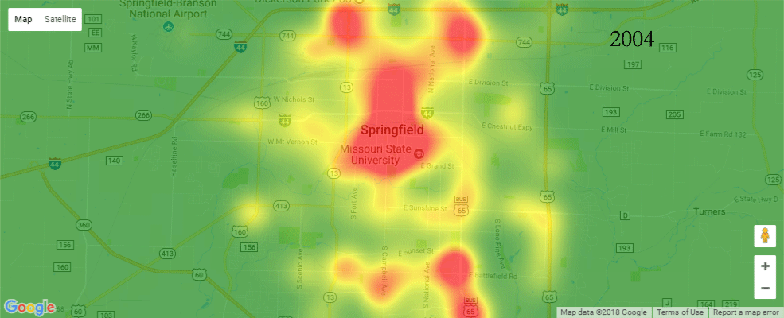

# Springfield-Crime Data

The Springfield-Crime dataset consists of 500,000 police reports filed in Springfield, Missouri between January, 2004 and December, 2016. A second Data-set is provided that includes month by month incident totals. A series of Jupyter Notebooks are included to show analysis. 

  * [Graphs](notebooks/Basic%20Analysis.ipynb)
  * [Heat Maps](notebooks/Heat%20Maps.ipynb)
  

### Collection Method

Data was collected from the now defunct website SpringfieldCrimeAlert using the Pandas read_html() method. A sample script, Scraper.py is provided to show how data was collected.  

### Limitations

##### Data Limitations

The data cannot be verified as complete as the collection methods for SpringfieldCrimeAlert(assumed to be a third party and not the Springfield Police Department) are not known. There is a strong case that reports are collected through the [police calls search page](https://www.springfieldmo.gov/1724/Police-Calls-Search) as descripitions and "approximate location" addresses are identical. This leaves concern that reports are being missed that are [filed online](https://www.springfieldmo.gov/873/Online-Police-Report). However, its also unclear how many reports are filed online rather than over the phone, and may be statistically insignificant to begin with.

##### External Factors. 
Given that 12 years of data are presented in the dataset the user must be careful in analyzing data without knowing what changes in reporting methods.

For example: taken on its own the following data suggests a decline in non-injury vehicle accidents beginning in 2014

However, there is a second report type. past non-injury vehicle accidents, look what happens when you overlay this graph with the former.

The data suggests a change in reporting procedures in which more non injury vehicle accidents are labeled as past rather than not, however this has not been verified. 
